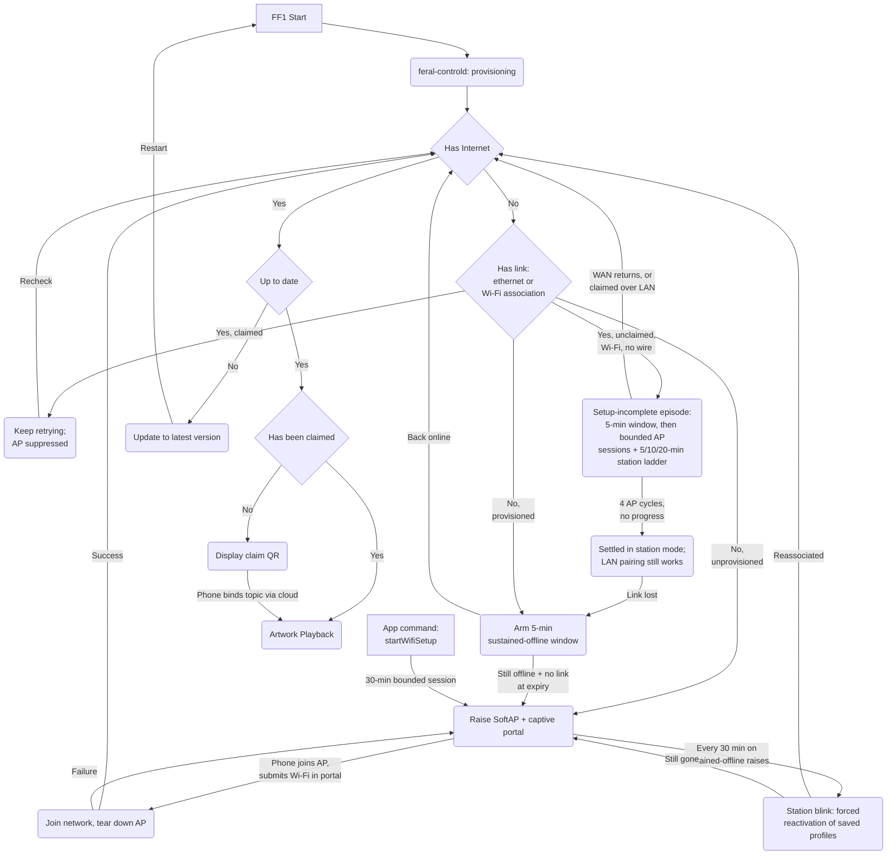
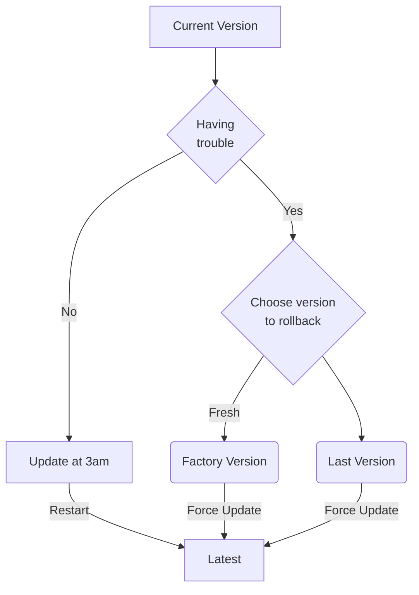
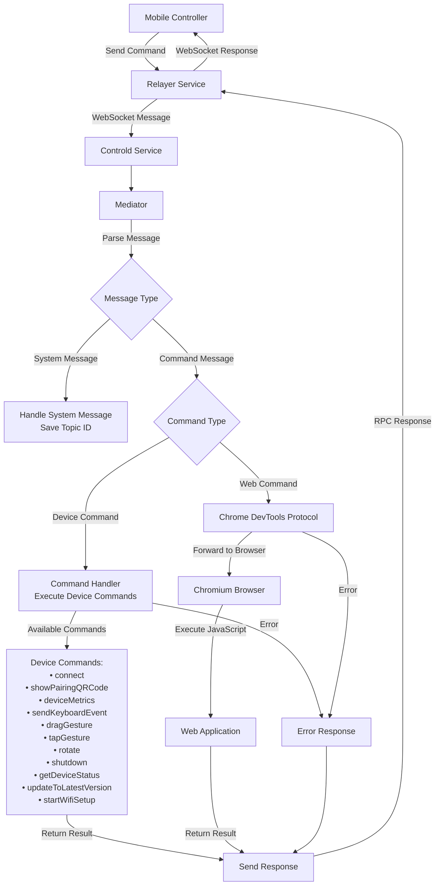

# FF1 Device life cycle

## App flows

### App startup

### AP session policy and network escape cadence

Since the network-recovery work (canonical rules in ffos-user
`docs/setup-flow.md`; API surface in its `docs/api-design.md`), a raised
setup AP carries a session policy latched from its raise reason, and
"link alive but useless" states have their own escape:

| Raise reason | Session |
| :- | :- |
| `unprovisioned` (out-of-box) | Unbounded, no recheck — nothing saved to reactivate. |
| `sustained-offline` / `relocated` | Unbounded cycles: AP up 30 min, then a brief station "recheck blink" that force-reactivates saved in-range profiles; a recovered network is noticed within one cycle. |
| `setup-incomplete` (unclaimed, live Wi-Fi link, no internet, no ethernet) | Bounded episode: 5-min window, 5-min AP sessions, escalating 5/10/20-min station phases; after 4 cycles the device settles in station mode where LAN pairing/`startWifiSetup` still work. Claimed devices never auto-raise on a live link. |
| `user-requested` (app `startWifiSetup`) | 30 min, then teardown and normal state handling — the abandonment net. Wired devices reject the command with `wired_link_active` instead of raising. |

Session teardowns defer while the captive portal saw a human action within
2 min (+15-min ceiling); bounded sessions additionally carry a 2-hour
absolute cap across portal rescan re-arms. Wired devices never auto-raise,
and a wired-link sighting lowers any raised AP except the out-of-box
`unprovisioned` session (nothing is saved to fall back to, and claiming
works over the cable with the AP still up). The app-visible mirror of all
this is the additive `network` health object on `getDeviceStatus` and the
LAN hub status routes.

### App update

### Command Processing Flow

## Telemetry (Heartbeat)

All the events should only consider network connected scenario otherwise it can't be sent over heartbeat.

### Device status
| Field | Type | Description |
| :--- | :--- | :--- |
| `Timestamp` | DateTime | The ISO 8601 timestamp (UTC) when the heartbeat was generated. |
| `MAC Address` | String | The unique, immutable MAC address of the network interface. |
| `Build` | String | The current firmware build version (e.g., "develop-0.0.1"). |
| `Screen Info` | String | String detailing screen status (e.g., "1920x1080@60"). |
| `CPU Temp` | Number | The core CPU temperature in Celsius (°C). **Alerts if > 55.** |
| `CPU Usage` | Percent | The current CPU utilization (0.00 to 1.00). **Alerts if > 0.80.** |
| `GPU Usage` | Percent | The current GPU utilization (0.00 to 1.00). **Alerts if > 0.80.** |
| `Memory Usage`| Percent | The percentage of total RAM currently in use (0.00 to 1.00). **Alerts if > 0.80.** |
| `Disk Usage` | Percent | The percentage of total disk storage currently in use (0.00 to 1.00). **Alerts if > 0.80.** |
| `Uptime` | String | The duration the device has been running since last boot, in "D H:M:S" format. |
| `Status` | String | **(Calculated)** "✅ Online" or "❌ Offline". Derived in the spreadsheet, not sent by device. |
| `Public Key` | String | The device's public key for signature verification. |
| `Signature` | String | The payload's cryptographic signature for data integrity. |
| `Page` | String | The on-screen setup state. Owned by `feral-controld` since the setupd merge (the `setupui` narration state; the coarse provisioning state is also exposed as `setup_state` on the LAN hub's `GET /api/status`). |
| `Page Uptime` | String | The duration the device has stayed in the current setup state, in "D H:M:S" format. |

### Setup states

Since the setupd merge, the on-screen setup state is owned by `feral-controld`. These states replace the former setupd page names:

| State | Notes |
| :- | :- |
| `softap_qr` | SoftAP provisioning QR: join `FF1-<device_id>` and open the captive portal (offline unprovisioned, escape-policy raises, or app-triggered `startWifiSetup`). |
| `joining` / `join_failed` | Joining the chosen Wi-Fi network / join failed, AP re-raised for retry. |
| `connecting` | Neutral provisioned-device connectivity narration (boot hedge, offline retry, recheck blink). Extension state: controld downgrades it for players that predate it. |
| `setup_error` | Persistent provisioning failure (setup AP repeatedly failing to start or release); retries continue underneath. Extension state with the same downgrade behavior. |
| `updating` | Firmware update in progress (replaces `SystemUpgrade`). |
| `claim_qr` | Pairing/claim QR shown; network connected and up to date (replaces the pairing `QRCode`). |
| `ready` / `hidden` | Claimed; artwork playback (replaces `WebApp`). |
| `factory_reset` | Device initiated rollback to factory version (replaces `FactoryReset`). |

## Version control

We deploy the firmware versions through 2 main channels:
- Dev channel: https://ffosdev.feralfile.com/
- Prod channel: https://ffos.feralfile.com/

Our versioning follow Semantic Versioning format.

Each channel has API to specific min_version and latest_version. If the current version on the device is older than min_version, it's forced to update. Otherwise, it will update to the latest version silently at 3am.